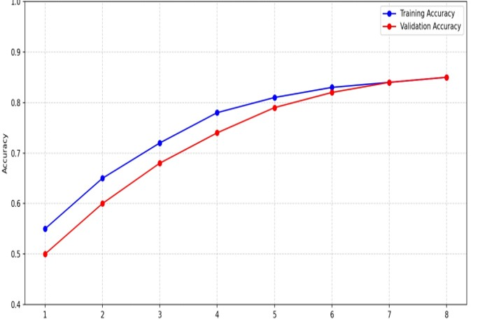
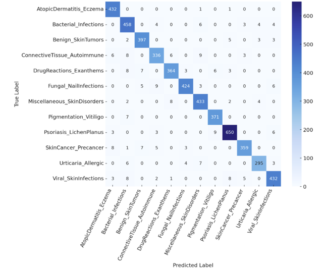
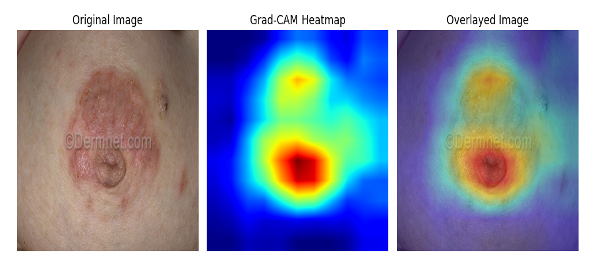

# Skin Disease Classification using Explainable AI (Grad-CAM)

## Overview

This project presents a Deep Learning–based Skin Disease Classification system integrated with Explainable AI (XAI) using Grad-CAM visualization.

The system is designed to classify dermatological conditions from clinical images and provide visual explanations highlighting the regions influencing model predictions.

This project aims to demonstrate the potential of AI-assisted dermatology triage support, particularly for low-resource settings.

## Problem Statement

Skin disease diagnosis can be challenging due to:
- Visual similarity between multiple dermatological conditions
- Limited access to dermatologists in rural or underserved areas
- Risk of misdiagnosis without expert evaluation

There is a need for AI systems that not only classify accurately but also provide transparency in decision-making.

## Solution Approach

The proposed system includes:

- Image preprocessing and resizing
- Class reduction and class balancing techniques
- Data augmentation for improved generalization
- CNN-based model training
- Model evaluation using accuracy and confusion matrix
- Grad-CAM visualization for explainability
- Gradio-based interface for interactive predictions

## Dataset

The model was trained on a dermatology image dataset (e.g., DermNet dataset from Kaggle).

> Note: The dataset is not included in this repository due to size constraints.

## Model Performance

- Final Accuracy: ~85%
- Multi-class classification
- Performance evaluated using confusion matrix and training curves

### Accuracy Graph

### Confusion Matrix

## Explainable AI – Grad-CAM

To improve model transparency, Grad-CAM (Gradient-weighted Class Activation Mapping) is used to visualize important regions in the input image influencing predictions.

### How Grad-CAM Works:

1. Extract feature maps from the final convolutional layer
2. Compute gradients of the predicted class
3. Weight feature maps using gradient importance
4. Generate heatmap
5. Overlay heatmap on original image

### Grad-CAM Results

This helps validate whether the model focuses on clinically relevant regions.

## Project Structure

## Technologies Used

- Python
- TensorFlow / Keras
- CNN (Convolutional Neural Networks)
- OpenCV
- NumPy
- Matplotlib
- Gradio
- Explainable AI (Grad-CAM)

## Future Improvements

- Integration with clinical-grade datasets
- Deployment as web-based diagnostic support tool
- Performance optimization using pretrained backbones
- Integration with hospital information systems

## Disclaimer

This project is intended for research and educational purposes only.  
It is not a substitute for professional medical diagnosis.
